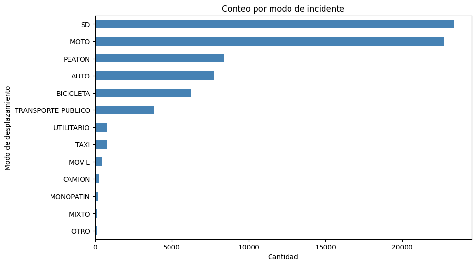
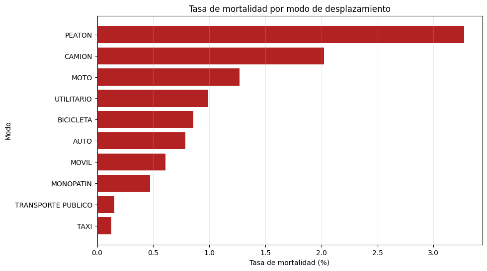
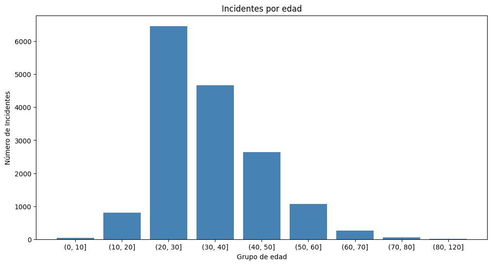
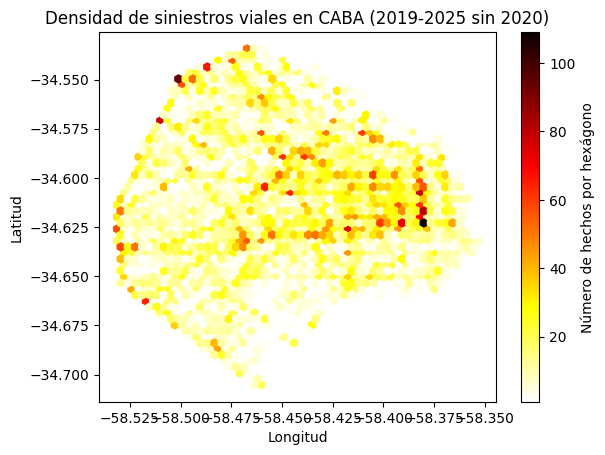

# Proyecto N-1: Siniestros Viales en CABA (2019-2025)

Análisis exploratorio de datos sobre siniestros viales en la Ciudad Autónoma de Buenos Aires, con foco en el aumento de accidentes de motociclistas.

## Contexto de negocio

El departamento de transporte de una gran ciudad enfrenta una crisis: aumento alarmante de accidentes de motociclistas, presión de prensa y exigencia del gobierno por respuestas. Se necesitaba responder 3 preguntas:
- ¿DÓNDE ocurren?
- ¿CUÁNDO ocurren?
- ¿QUÉ factores comunes tienen las víctimas?

## Dataset

- **Fuente:** [Siniestros Viales CABA - Buenos Aires Data](https://data.buenosaires.gob.ar/dataset/victimas-siniestros-viales)
- **Tamaño:** 65.818 hechos, 75.193 víctimas
- **Período:** 2019-2025 (excluyendo 2020 por COVID)
- **Tablas:** HECHOS (21 columnas) y VICTIMAS (9 columnas)

## Hallazgos principales

- **Moto:** modo con más víctimas identificadas (22.742, 43.8% del total sin SD) y más muertes absolutas (289).
- **Peatón:** modo más letal por accidente (3.27% de tasa de mortalidad).
- **Perfil del motociclista víctima:** hombre (82.8%), 20-29 años (40.4%), con pico en horario vespertino (15-18h), en las comunas 1, 15 y 12.
- **Tendencia:** +50% de crecimiento entre 2021 y 2025.
- **Limitación principal:** 31% sin modo de desplazamiento registrado. El conteo real podría ser mayor.

## Estructura del repositorio

- `Nivel1.ipynb` — Notebook completo con análisis, visualizaciones y documentación.

## Herramientas utilizadas

- Python 3.8+ (Pandas, NumPy)
- Matplotlib, Seaborn
- Google Colab

## Visualizaciones principales

### Distribución de víctimas por modo

### Tasa de mortalidad por modo

### Perfil etario de motociclistas

### Mapa de densidad de siniestros de moto

## Habilidades demostradas

- Limpieza de datos categóricos y numéricos sucios.
- Manejo de fechas en Pandas.
- Análisis temporal y geográfico.
- Cruce de tablas (merge).
- Visualización de datos.
- Documentación de decisiones y limitaciones.

Juan Carlos Muñoz — carlosdatasc
